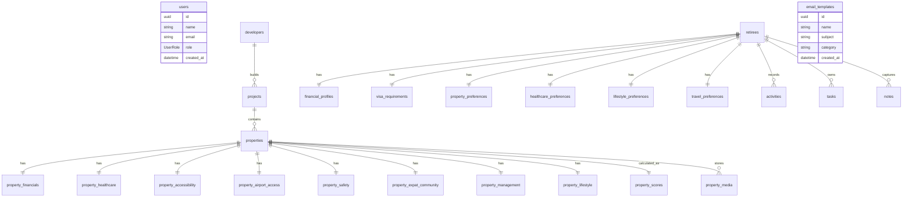

# TRELA/TRLA Database ERD

Phase 2 matching is computed dynamically by comparing `retirees` and their preference tables against `properties`, `projects`, `property_financials`, and `property_scores`.
