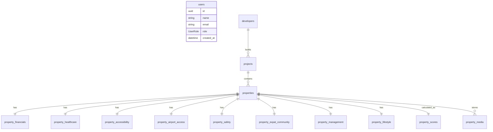

# TRELA Database ERD

```mermaid
erDiagram
  users { uuid id string name string email UserRole role datetime created_at }
  developers ||--o{ projects : builds
  projects ||--o{ properties : contains
  properties ||--|| property_financials : has
  properties ||--|| property_healthcare : has
  properties ||--|| property_accessibility : has
  properties ||--|| property_airport_access : has
  properties ||--|| property_safety : has
  properties ||--|| property_expat_community : has
  properties ||--|| property_management : has
  properties ||--|| property_lifestyle : has
  properties ||--|| property_scores : calculated_as
  properties ||--o{ property_media : stores
```
