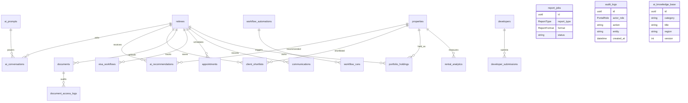

# TRELA/TRLA Database ERD

Phase 2 matching is computed dynamically by comparing `retirees` and their preference tables against `properties`, `projects`, `property_financials`, and `property_scores`.

## Phase 3 Platform Expansion

Multi-region fields are added to `projects` and `properties` (`country`, `province`, `region`, `city`, `submarket`) so TRLA can expand beyond Phuket into Hua Hin, Koh Samui, Pattaya, Chiang Mai, Bangkok, Krabi, and future international markets.
