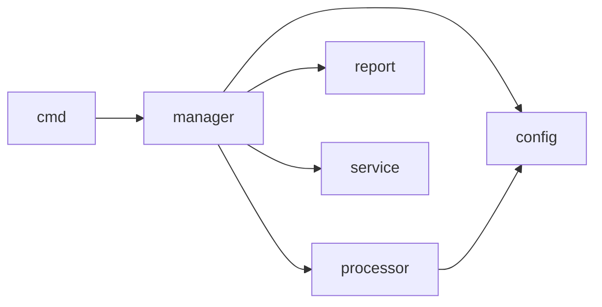

# Dependency Graph

<!-- sdd-knowledge-generated -->

## Feature Dependencies

## External Dependencies

| Package | Import Count |
|---------|--------------|
| `github.com` | 19 |

## See Also
- [service](../features/service.md) <!-- rel:strong -->
- [manager](../features/manager.md) <!-- rel:strong -->
- [config](../libs/config.md) <!-- rel:strong -->
- [info](../features/info.md) <!-- rel:strong -->
- [processor](../features/processor.md) <!-- rel:strong -->
