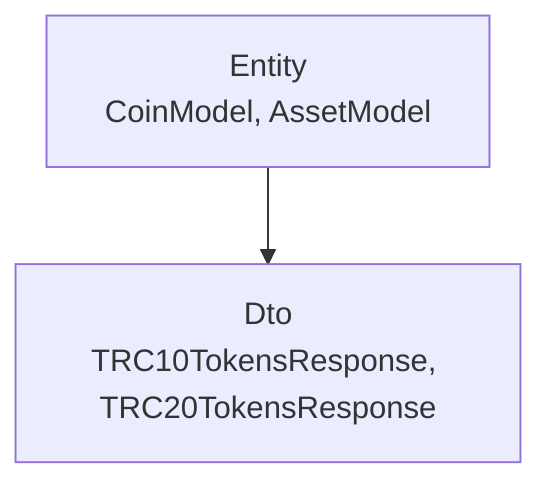
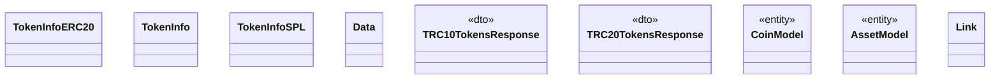

# Info

<!-- sdd-knowledge-generated -->

## Overview

- **Files**: 10
- **Symbols**: 35
- **Entities**: CoinModel, AssetModel
- **DTOs**: TRC10TokensResponse, TRC20TokensResponse

## Files

- `internal/info/asset.go` — ValidateAsset
- `internal/info/coin.go` — ValidateCoin
- `internal/info/external/erc20.go` — TokenInfoERC20, GetTokenInfoForERC20
- `internal/info/external/external.go` — TokenInfo, GetTokenInfo, GetTokenInfoByScraping
- `internal/info/external/spl.go` — TokenInfoSPL, Data, GetTokenInfoForSPL
- `internal/info/external/trc10.go` — TRC10TokensResponse, GetTokenInfoForTRC10
- `internal/info/external/trc20.go` — TRC20TokensResponse, GetTokenInfoForTRC20
- `internal/info/fields_validators.go` — ValidateAssetRequiredKeys, ValidateAssetType, ValidateAssetID, ValidateAssetDecimalsAccordingType, ValidateCoinRequiredKeys, ValidateLinks, ValidateCoinType, ValidateTags, ValidateDecimals, ValidateStatus, ValidateDescription, ValidateDescriptionWebsite, ValidateExplorer, isEmpty
- `internal/info/model.go` — CoinModel, AssetModel, Link, GetStatus
- `internal/info/values.go` — explorerURLAlternatives, linkNameAllowed, supportedLinkNames

## Architecture

### Layers

**Entity**: `CoinModel`, `AssetModel`

**Dto**: `TRC10TokensResponse`, `TRC20TokensResponse`

**Other**: `ValidateAsset`, `ValidateCoin`, `TokenInfoERC20`, `GetTokenInfoForERC20`, `TokenInfo`, `GetTokenInfo`, `GetTokenInfoByScraping`, `TokenInfoSPL`, `Data`, `GetTokenInfoForSPL`, `GetTokenInfoForTRC10`, `GetTokenInfoForTRC20`, `ValidateAssetRequiredKeys`, `ValidateAssetType`, `ValidateAssetID`, `ValidateAssetDecimalsAccordingType`, `ValidateCoinRequiredKeys`, `ValidateLinks`, `ValidateCoinType`, `ValidateTags`, `ValidateDecimals`, `ValidateStatus`, `ValidateDescription`, `ValidateDescriptionWebsite`, `ValidateExplorer`, `isEmpty`, `Link`, `GetStatus`, `explorerURLAlternatives`, `linkNameAllowed`, `supportedLinkNames`

### Data Flow

## Class Diagram

## External Dependencies

- `github.com`

## Minimum Viable Specification

> Auto-generated specification for the **Info** feature.

**Domain Model**: CoinModel, AssetModel

**Contracts**: TRC10TokensResponse, TRC20TokensResponse

**Key Types**: TokenInfoERC20, TokenInfo, TokenInfoSPL, Data, TRC10TokensResponse, TRC20TokensResponse, CoinModel, AssetModel, Link

