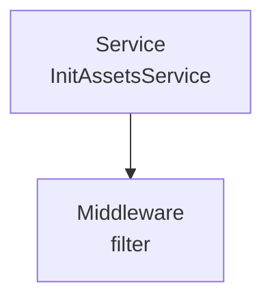

# Manager

<!-- sdd-knowledge-generated -->

## Overview

- **Files**: 2
- **Symbols**: 9
- **Services**: InitAssetsService

## Files

- `internal/manager/commands.go` — CreateAssetInfoJSONTemplate, AddTokenToTokenListJSON, getAssetInfo
- `internal/manager/manager.go` — InitCommands, handleAddTokenList, filter, InitAssetsService, setup, Execute

## Architecture

### Layers

**Service**: `InitAssetsService`

**Middleware**: `filter`

**Other**: `CreateAssetInfoJSONTemplate`, `AddTokenToTokenListJSON`, `getAssetInfo`, `InitCommands`, `handleAddTokenList`, `setup`, `Execute`

### Data Flow

## External Dependencies

- `github.com`

## Minimum Viable Specification

> Auto-generated specification for the **Manager** feature.

**Key Types**: none

