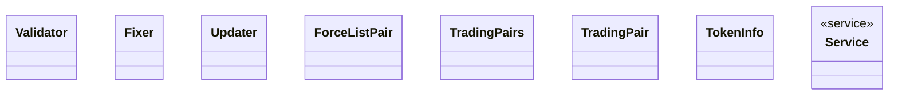

# Processor

<!-- sdd-knowledge-generated -->

## Overview

- **Files**: 4
- **Symbols**: 33
- **Services**: Service, NewService

## Files

- `internal/processor/fixers.go` — FixJSON, FixETHAddressChecksum, FixLogo, calculateTargetDimension, FixChainInfoJSON, FixAssetInfo
- `internal/processor/model.go` — Validator, Fixer, Updater, ForceListPair, TradingPairs, TradingPair, TokenInfo
- `internal/processor/service.go` — Service, NewService, GetValidator, GetFixers, GetUpdatersAuto
- `internal/processor/validators.go` — ValidateJSON, ValidateRootFolder, ValidateChainFolder, ValidateImage, ValidateAssetFolder, ValidateDappsFolder, ValidateChainInfoFile, ValidateAssetInfoFile, ValidateValidatorsListFile, isStackingChain, ValidateTokenListFile, ValidateTokenListExtendedFile, validateTokenList, ValidateInfoFolder, ValidateValidatorsAssetFolder

## Architecture

### Layers

**Service**: `Service`, `NewService`

**Other**: `FixJSON`, `FixETHAddressChecksum`, `FixLogo`, `calculateTargetDimension`, `FixChainInfoJSON`, `FixAssetInfo`, `Validator`, `Fixer`, `Updater`, `ForceListPair`, `TradingPairs`, `TradingPair`, `TokenInfo`, `GetValidator`, `GetFixers`, `GetUpdatersAuto`, `ValidateJSON`, `ValidateRootFolder`, `ValidateChainFolder`, `ValidateImage`, `ValidateAssetFolder`, `ValidateDappsFolder`, `ValidateChainInfoFile`, `ValidateAssetInfoFile`, `ValidateValidatorsListFile`, `isStackingChain`, `ValidateTokenListFile`, `ValidateTokenListExtendedFile`, `validateTokenList`, `ValidateInfoFolder`, `ValidateValidatorsAssetFolder`

## Class Diagram

## External Dependencies

- `github.com`

## Minimum Viable Specification

> Auto-generated specification for the **Processor** feature.

**Key Types**: Validator, Fixer, Updater, ForceListPair, TradingPairs, TradingPair, TokenInfo, Service

