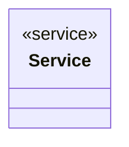

# Report

<!-- sdd-knowledge-generated -->

## Overview

- **Files**: 1
- **Symbols**: 6
- **Services**: Service, NewService

## Files

- `internal/report/service.go` — Service, NewService, IncErrors, IncTotalFiles, IsFailed, GetReport

## Architecture

### Layers

**Service**: `Service`, `NewService`

**Other**: `IncErrors`, `IncTotalFiles`, `IsFailed`, `GetReport`

## Class Diagram

## Minimum Viable Specification

> Auto-generated specification for the **Report** feature.

**Key Types**: Service

