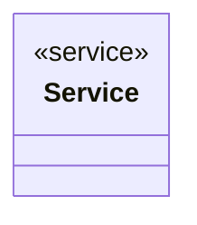

# Service

<!-- sdd-knowledge-generated -->

## Overview

- **Files**: 1
- **Symbols**: 9
- **Services**: Service, NewService

## Files

- `internal/service/service.go` — Service, NewService, RunJob, Check, Fix, RunUpdateAuto, runUpdaters, handleError, UnwrapComposite

## Architecture

### Layers

**Service**: `Service`, `NewService`

**Other**: `RunJob`, `Check`, `Fix`, `RunUpdateAuto`, `runUpdaters`, `handleError`, `UnwrapComposite`

## Class Diagram

## External Dependencies

- `github.com`

## Minimum Viable Specification

> Auto-generated specification for the **Service** feature.

**Key Types**: Service

## See Also
- [config](../libs/config.md) <!-- rel:strong -->
- [call graph](../architecture/call-graph.md) <!-- rel:strong -->
- [validator fixer updater](../patterns/validator-fixer-updater.md) <!-- rel:strong -->
- [go conventions](../code-conventions/go-conventions.md) <!-- rel:related -->
- [dependency graph](../architecture/dependency-graph.md) <!-- rel:related -->
