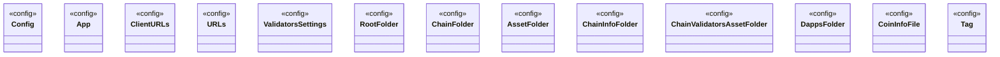

# Config

<!-- sdd-knowledge-generated -->

## Overview

- **Files**: 3
- **Symbols**: 14

## Files

- `internal/config/config.go` — Config, App, ClientURLs, URLs, ValidatorsSettings, SetConfig
- `internal/config/validators.go` — RootFolder, ChainFolder, AssetFolder, ChainInfoFolder, ChainValidatorsAssetFolder, DappsFolder, CoinInfoFile, Tag
- `internal/config/values.go`

## Class Diagram

## External Dependencies

- `github.com`

## Minimum Viable Specification

> Auto-generated specification for the **Config** feature.

**Key Types**: Config, App, ClientURLs, URLs, ValidatorsSettings, RootFolder, ChainFolder, AssetFolder, ChainInfoFolder, ChainValidatorsAssetFolder, DappsFolder, CoinInfoFile, Tag

## See Also
- [models](../architecture/data/models.md) <!-- rel:strong -->
- [service](../features/service.md) <!-- rel:strong -->
- [token models](../architecture/data/token-models.md) <!-- rel:strong -->
- [info](../features/info.md) <!-- rel:strong -->
- [manager](../features/manager.md) <!-- rel:strong -->
